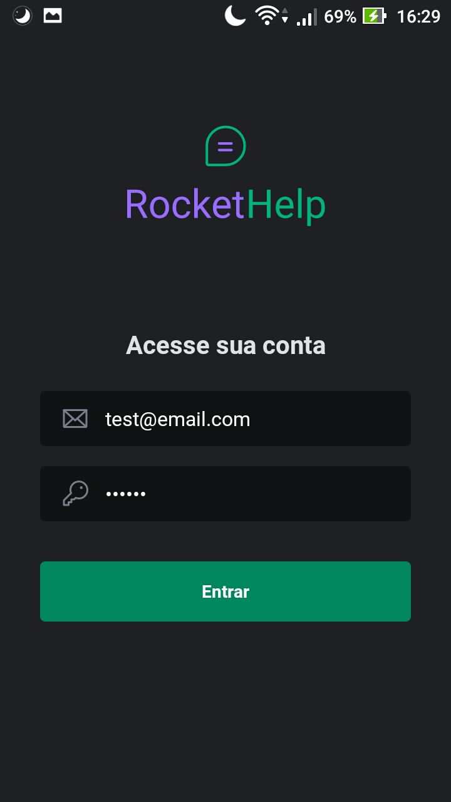

# ROCKET APP
This app was made in one event of educational institute Rocketseat, and consist in one software were auxiliate the day of one IT technician, creating and listing equipament with defects, warning the same if the repair is completed or not.

## HOW TO TEST
This app was not made with intention to publish, but if you wish to test this app, you could download using this link: 
<a href="https://expo.dev/artifacts/eas/vh8xepUoDce1KVf1THy39Q.apk" target="_blank">
  https://expo.dev/artifacts/eas/vh8xepUoDce1KVf1THy39Q.apk
</a> 

When you finish the installation, you will see this screen:

 

Insert the email "test@email.com" and the password "123456", and you will be able to access and enjoy the app.